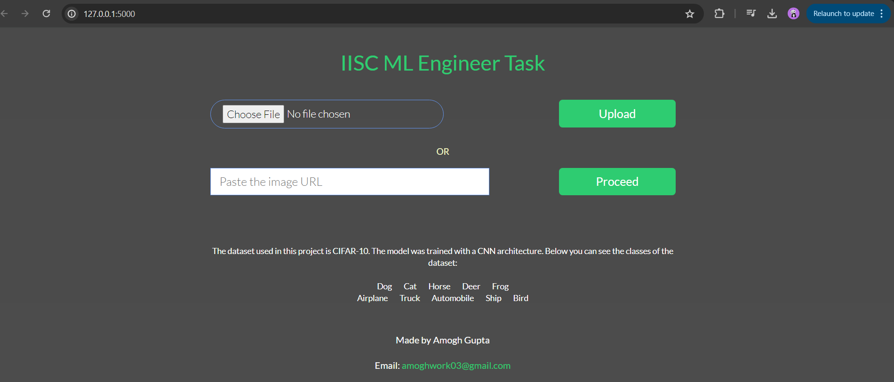

# CIFAR-10 C


## Project Overview:
This project delves into the realm of image processing, a fascinating field within artificial intelligence (AI). Leveraging the capabilities of AI, particularly in image analysis and understanding, the project aims to demonstrate the power and versatility of modern machine learning techniques.

## Dataset and Architecture:
At the heart of this project lies the CIFAR-10 dataset, a widely recognized benchmark in the field of computer vision. CIFAR-10 consists of 60,000 32x32 color images in 10 classes, with 6,000 images per class. It serves as an excellent testbed for image classification tasks due to its diversity and complexity.

## Convolutional Neural Networks (CNNs):
To tackle the challenges posed by the CIFAR-10 dataset, we employ Convolutional Neural Networks (CNNs). CNNs are a class of deep neural networks particularly well-suited for processing visual data. By leveraging convolutional layers, pooling layers, and fully connected layers, CNNs can automatically learn hierarchical representations of images, enabling them to achieve impressive performance on tasks such as image classification.

1. [ DATASET ](#DATASET)
2. [ Deep Learning - CNN ](#DeepLearning-CNN)
3. [ FLASK ](#FLASK)
4. [ How to Run ](#HowtoRun)

<a name="DATASET"></a>
## 1. DATASET
The [CIFAR-10](https://www.cs.toronto.edu/~kriz/cifar.html) dataset consists of 60000 32x32 colour images in 10 classes, with 6000 images per class. There are 50000 training images and 10000 test images. It was collected by Alex Krizhevsky, Vinod Nair, and Geoffrey Hinton.

<p align="center">

</p>

<a name="DeepLearning-CNN"></a>
## 2. CNN 
## Model Enhancements
In our quest for superior performance, we have made several enhancements to our model architecture. First and foremost, we have increased the complexity of the model, enabling it to capture more intricate patterns and features within the data.

## Optimization Techniques
To train our model effectively, we employ the Adam optimizer with default parameters. Additionally, we integrate advanced optimization techniques such as ReduceLROnPlateau and EarlyStopping callbacks. These techniques dynamically adjust the learning rate and halt training when performance metrics plateau, preventing overfitting and overtraining.

## Significance and Impact
By leveraging cutting-edge techniques in data preprocessing, model architecture, and optimization, this project aims to showcase the potential of AI in image processing. The insights gained from this research have far-reaching implications across various industries, from healthcare to autonomous systems.
After the model training is finished, the accuracy and loss graphs of the training are shown in the following two figures. The accuracy of the model is **%92.05**.


<a name="FLASK"></a>
## 3. FLASK
Flask is a lightweight and flexible web framework for Python. It's often referred to as a "micro" framework because it provides the essentials for building web applications without imposing too many dependencies or restrictions. Unlike some larger frameworks, Flask allows developers to choose the tools and libraries they need for their specific project requirements.

## Loading Images:
With Flask, you have the flexibility to load images from either the local file system or from URLs. This means that users can upload images directly from their device or provide a link to an image hosted elsewhere on the web. Flask provides convenient mechanisms for handling file uploads and fetching data from external sources.

## Predictions and Percentages:
Once an image is loaded, Flask processes it through a machine learning model or some other form of analysis to make predictions about its content. In the context of image classification, these predictions typically involve identifying the main objects or features present in the image. Flask then presents the top three predictions along with their corresponding probabilities or percentages.

<p align="center">

</p>

<p align="center">

</p>

<a name="HowtoRun"></a>
## 4. How to Run


1. Fork this repository.
 ```console
$ git clone https://github.com/FieryDeveloper/MLTask-CIFAR.git

```

2. Load the dependencies of the project

**NOTE:** This dependencies not including the Deep Learning part. Colab meet all dependencies (such as tensorflow).

 ```console
pip install -r requirements.txt
```

3. Now run app.py. 
